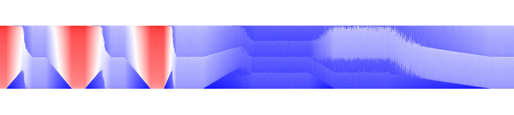
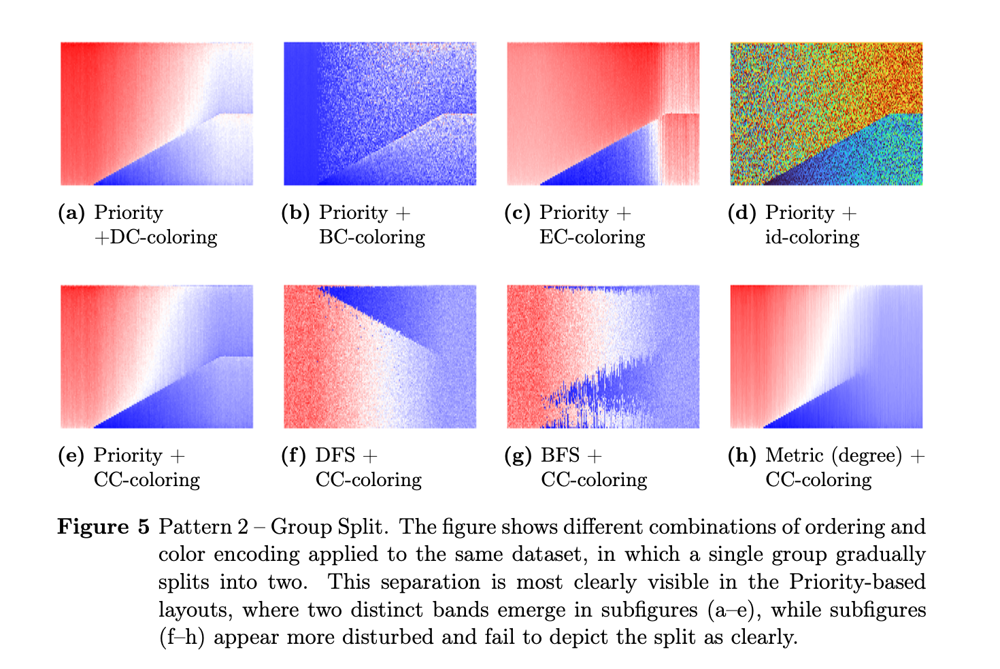
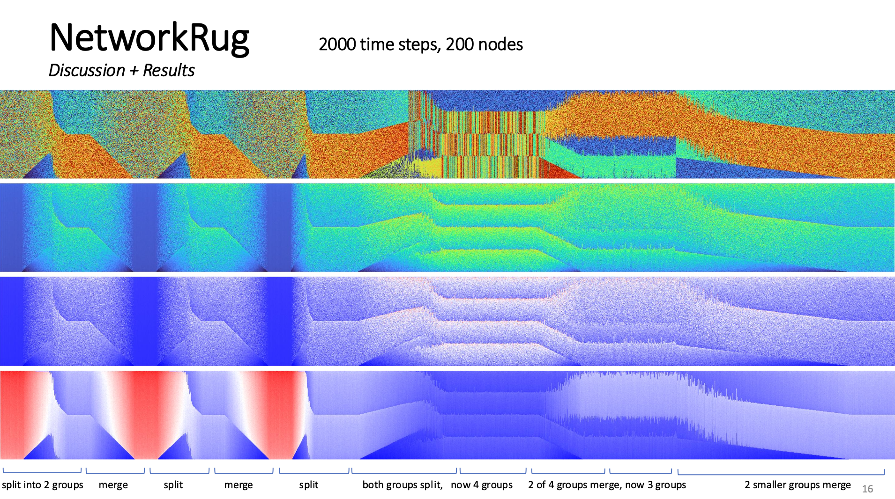

# NetworkRugs

### Ordering Strategies for 1D Pixel Visualization for Dynamic Networks

This project explores compact 1D pixel visualizations, called NetworkRugs, for dynamic networks, using a variety of graph-based metrics and node ordering strategies. Implemented in Python with NetworkX and visualized via Matplotlib, the framework enables comparison of different orderings and experimentation with various color encodings.

#### Abstract
Analysing how communities form, evolve, and dissolve over time is a key task in many scientific fields, including social sciences, biology, and art history. In domains such as exhibition analysis, understanding how artists affiliate with different stylistic movements or curatorial groupings across decades requires tools that can visually capture temporal changes in group structures. However, existing visualization techniques for dynamic networks often suffer from visual clutter, limited scalability, and disruptions in the analyst’s mental map.
This thesis addresses the challenge of designing scalable ordering strategies that are sensitive to community structure. It investigates whether a novel BFS-based ordering strategy supports the detection of group structure changes in dynamic networks via NetworkRugs, and which structural patterns this visualization technique can effectively reveal.

Therefore, this work introduces a Priority-Based Breadth-First Search (Priority-BFS) algorithm that generates a 1D node ordering by integrating structural heuristics, specifically edge weight, node degree, and common neighborhood size, into the traversal process. This ordering strategy is implemented within the NetworkRugs visualization technique, which encodes each network snapshot as a vertical pixel column and arranges them chronologically to create a compact, static display that preserves local coherence.

The effectiveness of this approach is assessed through a use-case-driven evaluation on synthetic dynamic networks with specifically placed ground-truth events, such as group splits, merges, emergence, and dissolution. The results demonstrate that the Priority-BFS ordering, particularly when paired with centrality-based color encodings, produces clear and interpretable visual patterns that correspond to the underlying structural changes. Compared to baseline methods, the proposed strategy more consistently present locality and improved the interpretability of group transitions. This work's primary contributions are the implementation of a modular pipeline for visualizing dynamic networks with NetworkRugs, the development of the structurally-aware Priority-BFS ordering method, and a qualitative evaluation of the resulting visual patterns.


#### Key Components

##### Interactive Interface
- interface.py: Interface for parameter testing and visualization generation
- data_generation.py: Functions for generating synthetic test data with configurable properties

##### Core Utilities
- orderings.py: Functions for generating different node orderings
- visualization.py: Functions for creating the NetworkRug visualizations
- network_rugs.py: NetworkRugs generation functionality
- color.py: Functionality for color mapping
- neighborhoods.py: Functions related to graph neighborhoods


##### Usage
1. Install dependencies:
```bash
pip install -r requirements.txt
```

2. Launch the interface in a Jupyter Notebook (e.g., demo.ipynb):
```
import ba_utils.interface as interface
interface.start_gui()
```


#### Some results





